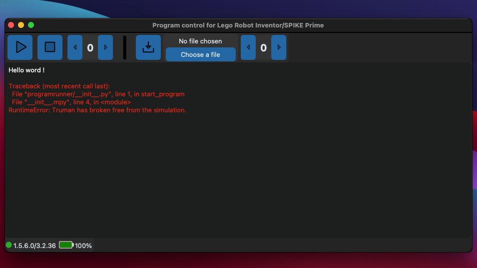

Mindstorms Program Control
==========================

"Mindstorms Program Control" is a very simple Python library that allows you to control your Mindstorms or Spike Prime hub. With the GUI tool, you can: start and stop programs, upload new Python programs to the hub, and see the program's output in the integrated terminal. Moreover, this interface works on Windows, Linux, and macOS.


_Here is an example on macOS_


## Installation

1. You can install the library by running the following command in your terminal. But this method requires having git installed on your computer. If this is not the case, follow the second method.
```
pip3 install git+https://github.com/tibor-david/ms-program-control 
```
(_or `pip` on Windows_)


2. First you need to download the 'msprogramcontrol-x.y.z.zip' file on the release section. Once you download it, extract the`.zip` file. Finally go to the extraction folder and run this command in your terminal : 

_Replace `x.y.z`_ by the version you have dowloaded.
```
pip3 install ./msprogramcontrol-x.y.z-py3-none-any.whl
```

The first method allows you to get the latest modifications while the second method gives you the latest release.

## Usages
To start the interface, launch the following command in your terminal. After that, the interface will appear and you can now use the library.

```
python3 -m msprogramcontrol
```
(_or `python` on Windows_)

